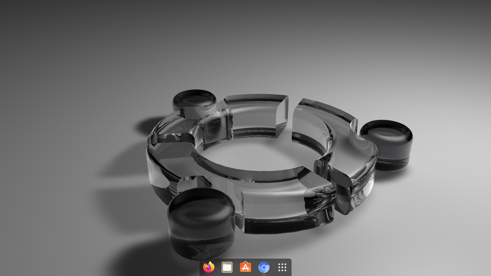

# Ubuntu config

This repo is for keeping track of customisations I made to Ubuntu.

## Terminal related (and installs)
To import my treminal settings download the usable-theme-profile.dconf from this repo and do  
``` dconf load /org/gnome/terminal/legacy/profiles:/:1430663d-083b-4737-a7f5-8378cc8226d1/ < path/to/usable-theme-profile.dconf``` 

Copy the bashrc file from this repo into ```~.bashrc``` and do
``` source .bashrc ```

#### Install drivers for nvidia (optional)
```
linux-modules-nvidia-440-generic-hwe-20.04
nvidia-driver-440
```

#### Install gnome-tweaks and gnome shell extensions
```
sudo apt-get update
sudo apt upgrade
sudo add-apt-repository universe
sudo apt install gnome-tweak-tool $(apt search gnome-shell-extension | grep ^gnome | cut -d / -f1)
```

#### Install other usefull tools
Like nodejs, npm, python3-venv etc
```
sudo apt install apt-transport-https build-essential cargo curl dconf-editor git gnome-shell-extensions gnome-tweak-tool google-chrome-stable libgtk-3-dev make neofetch nodejs npm python3-venv rustc steam sublime-text
```

## Dock
In the installed dconf editor search for dash-to-dock. Changes made here affect the dock directly. The changes I made are:
- Set extend-height to false
- Set the dock to bottom

## Tweaks
To make adding extensions easier, add [this](https://addons.mozilla.org/en-US/firefox/addon/gnome-shell-integration/) to firefox and open the following liks with firefox. In the gnome tweaks tool, install the following extensions
- [hide-top-bar](https://extensions.gnome.org/extension/545/hide-top-bar/)
- [Unite](https://extensions.gnome.org/extension/1287/unite/)
- Anything else added in the future

#### Hide-top-bar
Allways hide and show panel when mouse approaches. Disable all options under 'IntelliHide'

#### Unite
Disable everything / set everything to 'never'. Set only 'Hide window titlebar' to 'Always' and set 'Auto focus new windows' to true

## Pop shell (WindowManager)
Pretty fun, shows up in tweaks when configured correctly.

#### Install
To get pop-shell:
```
sudo apt install node-typescript --global
git clone https://github.com/pop-os/shell
cd shell
./rebuild.sh
```

To get shortcuts(optional):
```
git clone https://github.com/pop-os/shell-shortcuts
cd shell-shortcuts
make
sudo make install
```
#### Remove
To remove pop-shell
```
rm -r ~/.local/share/gnome-shell/extensions/pop-shell@system76.com
```
To remove shortcuts:
```
sudo rm /usr/local/bin/pop-shell-shortcuts
```

## Misc
- Wallpaper from [here](https://wallpapercave.com/w/KY7lCZb)
- Disable the 'Ctrl + Space' shortcut as it hinders games


## Screenshots

